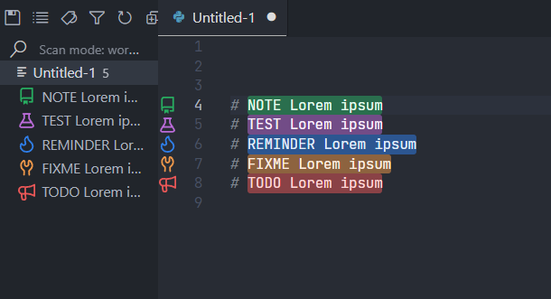

# A simple backup for my config file

## Todo Tree Config VScode


```json
 "todohighlight.isEnable": true,
    "todo-tree.general.tags": 
    [
      "BUG",
      "TODO",
      "@TODO",
      "FIXME",
      "FIX",
      "FIXIT",
      "#TODO",
      "TEST",
      "NOTE",
      "REMINDER"
    ], 
    "todo-tree.general.tagGroups": {

      "FIXME": [
          "FIXME",
          "FIXIT",
          "FIX",
      ],
      "TODO": [
          "TODO",
          "todo",
          "@TODO",
      ]
  },
    "todo-tree.highlights.defaultHighlight": {
        "icon": "alert",
        "type": "text",
        // "foreground": "white",
        // "background": "#EB5757",
        "opacity": 50,
        "iconColour": "#EB5757"
    },
    
    "todo-tree.highlights.customHighlight": {
        
        "NOTE": {
          "icon": "repo",
          "background": "#27AE60",
          "foreground": "#E5FFF0",
          "color" : "black",
          "iconColour": "#27AE60",
          "gutterIcon": true
        },
        "TEST": {
          "icon": "beaker",
          "background": "#BB6BD9",
          "foreground": "#FBF0FF",
          "color" : "black",
          "iconColour": "#BB6BD9",
          "gutterIcon": true
        },
        "REMINDER": {
          "icon": "flame",
          "background": "#2F80ED",
          "foreground": "#E3EFFE",
          "color" : "black",
          "iconColour": "#2F80ED",
          "gutterIcon": true
        },
        "FIXME": {
          "icon": "tools",
          "background": "#F2994A",
          "foreground": "#FFF0E2",
          "color" : "black",
          "iconColour": "#F2994A",
          "gutterIcon": true
        },
        "TODO": {
          "icon": "megaphone",
          "background": "#EB5757",
          "foreground": "#FFD9D9",
          "color" : "black",
          "iconColour": "#EB5757",
          "gutterIcon": true
      }

```
